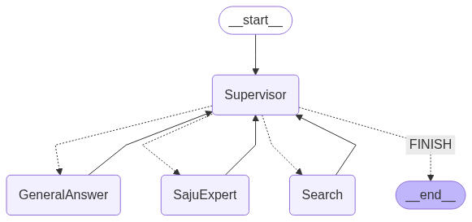

# FortuneAI 🔮

**AI 기반 사주팔자 상담 시스템**

FortuneAI는 LangGraph와 RAG(Retrieval-Augmented Generation) 기술을 활용하여 사주팔자와 타로 관련 질문에 대해 전문적이고 자연스러운 상담을 제공하는 AI 시스템입니다.

## ✨ 주요 기능

- 🤖 **LangGraph 멀티 에이전트 시스템**: Supervisor 패턴 기반 전문 에이전트 협업
- 🔍 **하이브리드 검색**: FAISS 벡터 검색과 BM25를 결합한 고도화된 문서 검색
- 📚 **전문 지식 기반**: 사주팔자 및 타로 관련 전문 서적 데이터베이스
- 💬 **대화 기록 관리**: 세션별 대화 컨텍스트 유지
- 🎯 **리랭킹 시스템**: FlashRank를 활용한 검색 결과 최적화
- 🌐 **다중 LLM 지원**: OpenAI GPT, Google Gemini 모델 지원
- 🔀 **조건부 워크플로**: 질문 유형별 최적화된 처리 경로

## 🏗️ 시스템 아키텍처

### LangGraph 멀티 에이전트 시스템
아래는 FortuneAI의 멀티 에이전트 워크플로 상태 전이 다이어그램입니다.



**워크플로 해석:**
- **Supervisor**가 중앙 라우터 역할을 하며, 입력을 분석하여 적절한 전문 에이전트로 분기합니다
- **SajuExpert**: 사주 관련 전문 작업 수행
- **Search**: RAG 검색 및 웹 검색 작업 수행  
- **GeneralAnswer**: 일반적인 질문 응답 처리
- 각 에이전트의 처리가 완료되면 Supervisor로 돌아가거나, 필요시 FINISH로 종료됩니다
- 이 구조는 조건부 분기와 반복 처리를 통해 유연한 대화 흐름을 지원합니다

```
사용자 입력 → Supervisor → SajuExpert/Search/GeneralAnswer → 최종 응답
     ↓           ↓              ↓                              ↓
   질문 분류   라우팅 결정    전문 작업 수행                통합 답변
```

### 핵심 구성 요소

- **Supervisor Agent**: 질문 분석 및 에이전트 라우팅
- **SajuExpert Agent**: 정밀 사주팔자 계산 및 해석
- **Search Agent**: RAG 검색 및 웹 검색 통합
- **GeneralAnswer Agent**: 일반적인 질문 응답
- **벡터 스토어**: FAISS 기반 임베딩 저장소
- **임베딩 모델**: BAAI/bge-m3 (다국어 지원)
- **검색 시스템**: 하이브리드 검색 (벡터 + BM25)
- **리랭커**: FlashRank 기반 검색 결과 재정렬
- **LLM**: OpenAI GPT-4.1-mini / Google Gemini

## 📋 요구사항

- Python 3.11
- Poetry (의존성 관리)
- CUDA (선택사항, GPU 가속)

## 🚀 설치 및 설정

### 1. 저장소 클론
```bash
git clone https://github.com/your-username/FortuneAI.git
cd FortuneAI
```

### 2. Poetry를 통한 의존성 설치
```bash
poetry install
```

### 3. 환경 변수 설정
`.env` 파일을 생성하고 다음 API 키를 설정하세요:

```env
OPENAI_API_KEY=your_openai_api_key_here
GOOGLE_API_KEY=your_google_api_key_here
```

### 4. 벡터 데이터베이스 초기화
```bash
poetry run python -c "from reranker import create_saju_compression_retriever; create_saju_compression_retriever()"
```

## 💻 사용법

### 메인 시스템 실행
```bash
poetry run python main.py
```

### 대화형 상담 시작
```
🔮 FortuneAI - LangGraph 사주 시스템 🔮
============================================================
✨ Supervisor 패턴 기반 고성능 사주 계산기
🎯 전문가 검증 완료
🚀 LangGraph 멀티 에이전트 시스템
------------------------------------------------------------
📝 사용법:
  • 사주 계산: '1995년 8월 26일 오전 10시 15분 남자 사주'
  • 운세 상담: '1995년 8월 26일생 2024년 연애운'
  • 일반 검색: '사주에서 십신이란?'
  • 종료: 'quit' 또는 'exit'
  • 디버그: 'debug:질문' (상세 실행 정보)
============================================================

🤔 질문: 1992년 8월 15일 오전 10시에 태어났습니다. 사주를 봐주세요.
🔮 [AI 상담사의 답변]
```

### 명령어
- `new`: 새로운 대화 세션 시작
- `help`: 사용 가이드 표시
- `debug:질문`: 디버그 모드로 실행
- `q` 또는 `exit`: 프로그램 종료

## 📁 프로젝트 구조

```
FortuneAI/
├── main.py              # 메인 실행 파일 (LangGraph 시스템)
├── agents.py            # AgentManager - 에이전트 생성 및 관리
├── nodes.py             # NodeManager - 워크플로 노드 함수들
├── state.py             # AgentState - 워크플로 상태 정의
├── graph.py             # create_workflow - LangGraph 워크플로 구성
├── tools.py             # 도구 모음 (사주계산, RAG, 웹검색)
├── saju_calculator.py   # 정밀 사주팔자 계산 엔진
├── reranker.py          # 문서 리랭킹 시스템
├── vector_store.py      # 벡터 스토어 관리
├── models.py            # LLM 및 임베딩 모델 설정
├── prompts.py           # 프롬프트 템플릿 관리
├── utils.py             # 유틸리티 함수들
├── faiss_saju/          # FAISS 벡터 데이터베이스
│   └── all_saju_data/   # 사주 관련 벡터 데이터
└── pyproject.toml       # 프로젝트 설정 및 의존성
```

## 🔧 주요 모듈

### LangGraph 워크플로 시스템
```python
from main import run_query_with_app
from graph import create_workflow

# 워크플로 생성
app = create_workflow()

# 사주 상담 실행
response = await run_query_with_app(app, "1992년 8월 15일 오전 10시 사주")
```

### 에이전트 관리
```python
from agents import AgentManager

# 에이전트 관리자 초기화
agent_manager = AgentManager()

# 전문 에이전트 생성
supervisor = agent_manager.create_supervisor_agent()
saju_expert = agent_manager.create_saju_expert_agent()
search_agent = agent_manager.create_search_agent()
general_agent = agent_manager.create_general_answer_agent()
```

### 노드 관리
```python
from nodes import NodeManager

# 노드 관리자 (싱글톤)
node_manager = NodeManager()

# 노드 함수들
supervisor_node = node_manager.supervisor_agent_node
saju_node = node_manager.saju_expert_agent_node
search_node = node_manager.search_agent_node
general_node = node_manager.general_answer_agent_node
```

### 상태 관리
```python
from state import AgentState, BirthInfo, SajuInfo

# 워크플로 상태 정의
state = AgentState(
    question="사용자 질문",
    messages=[],
    next="Supervisor",
    session_id="session_123",
    birth_info=BirthInfo(...),
    saju_info=SajuInfo(...)
)
```

### 사주 계산 엔진
```python
from saju_calculator import SajuCalculator

# 정밀 사주팔자 계산
calculator = SajuCalculator()
saju_data = calculator.calculate_saju(
    birth_date="1992-08-15", 
    birth_time="10:00",
    is_male=True
)
```

### 도구 모음
```python
from tools import (
    saju_tools,
    search_tools,
    general_qa_tools,
    supervisor_tools
)

# 각 에이전트별 도구 사용
saju_expert_tools = saju_tools
search_agent_tools = search_tools
general_agent_tools = general_qa_tools
supervisor_tools = supervisor_tools
```

## 📊 성능 최적화

### LangGraph 멀티 에이전트 시스템
- **Supervisor 패턴**: 질문 유형별 최적 에이전트 라우팅
- **싱글톤 노드 관리**: 효율적인 노드 생성 및 재사용
- **조건부 워크플로**: 생년월일시 → 사주계산 → 해석 순차 처리
- **Pydantic 타입 안전성**: 구조화된 출력으로 안정성 확보
- **무한 루프 방지**: 애매한 입력에 대한 조기 종료 로직

### 검색 시스템
- **FAISS 벡터 검색**: 고속 유사도 검색
- **BM25 키워드 검색**: 정확한 키워드 매칭
- **하이브리드 검색**: 벡터 + 키워드 검색 결합
- **FlashRank 리랭킹**: 검색 결과 품질 개선
- **문서 압축**: 긴 문서의 핵심 내용 추출

## 🛠️ 개발 환경

### Jupyter Notebook 지원
- `test.ipynb`: 기능 테스트 및 실험
- `langgraph.ipynb`: LangGraph 실험
- `agent.ipynb`: 에이전트 테스트

### 개발 도구
```bash
# 개발 의존성 설치
poetry install --with dev

# 타입 체크
poetry run mypy .

# 테스트 실행
poetry run jupyter notebook test.ipynb
```

## 📚 데이터 소스

프로젝트에 포함된 전문 서적:
- **Four Pillar Unveil Your Destiny**: 사주팔자 완전 가이드
- **The Complete Guide to the Tarot**: 타로 완전 가이드
- **Simple Chinese Astrology**: 중국 점성술 기초
- **Chinese Horoscope**: 중국 운세 해석

## 🔄 워크플로 프로세스

### 1. Supervisor 단계
- 사용자 질문 분석
- 출생 정보 파싱 (있는 경우)
- 질문 유형 분류 (saju/general/concept)
- 적절한 에이전트로 라우팅

### 2. 전문 에이전트 단계
- **SajuExpert**: 사주 계산 및 운세 해석
- **Search**: RAG 검색 및 웹 검색
- **GeneralAnswer**: 일반적인 질문 응답

### 3. 결과 통합 단계
- 에이전트 결과 수집
- 최종 답변 생성
- 사용자에게 응답

## 🤝 기여하기

1. Fork the Project
2. Create your Feature Branch (`git checkout -b feature/AmazingFeature`)
3. Commit your Changes (`git commit -m 'Add some AmazingFeature'`)
4. Push to the Branch (`git push origin feature/AmazingFeature`)
5. Open a Pull Request

## 📄 라이선스

이 프로젝트는 MIT 라이선스 하에 배포됩니다. 자세한 내용은 `LICENSE` 파일을 참조하세요.

## 👨‍💻 개발자

- **MinhyeongL** - *Initial work* - [minhyung0123@gmail.com](mailto:minhyung0123@gmail.com)

## 🙏 감사의 말

- [LangChain](https://langchain.com/) - RAG 파이프라인 프레임워크
- [LangGraph](https://langchain.com/langgraph) - 멀티 에이전트 워크플로
- [FAISS](https://github.com/facebookresearch/faiss) - 벡터 검색 라이브러리
- [FlashRank](https://github.com/PrithivirajDamodaran/FlashRank) - 리랭킹 시스템
- [BGE-M3](https://huggingface.co/BAAI/bge-m3) - 임베딩 모델

---

**FortuneAI**로 AI의 힘을 빌려 전통적인 사주팔자 상담을 현대적으로 경험해보세요! 🌟